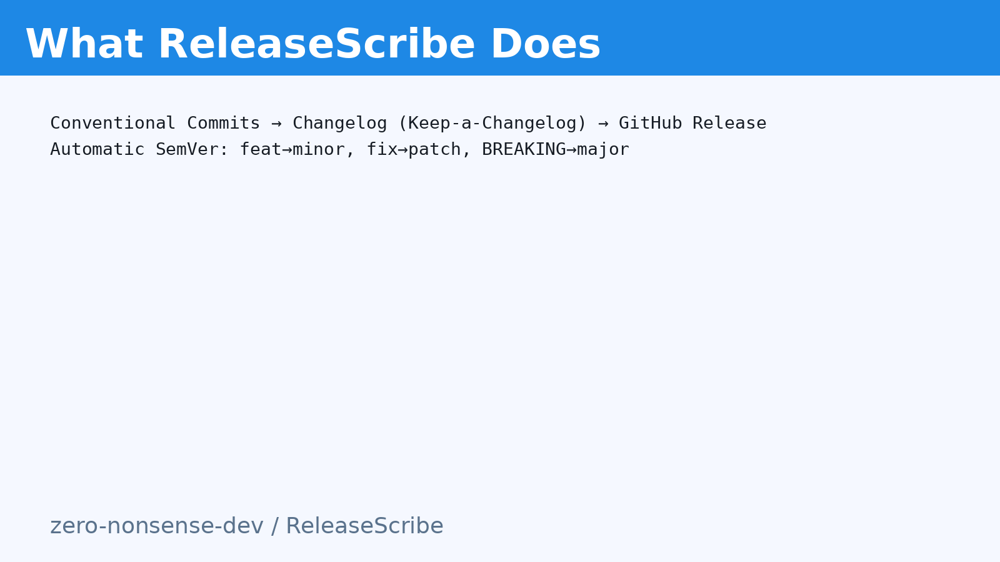
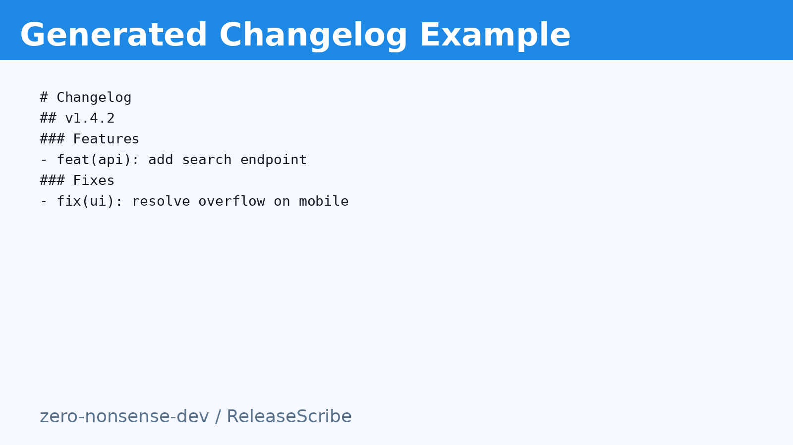
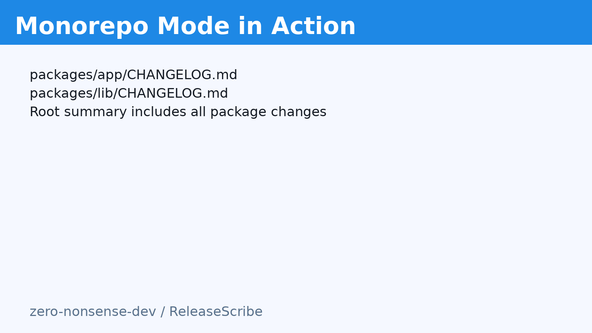
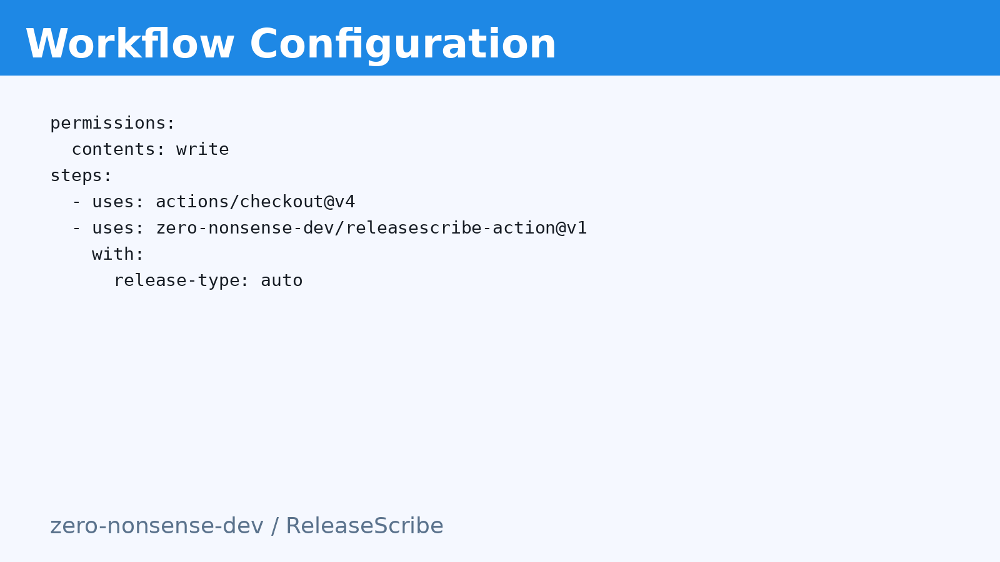
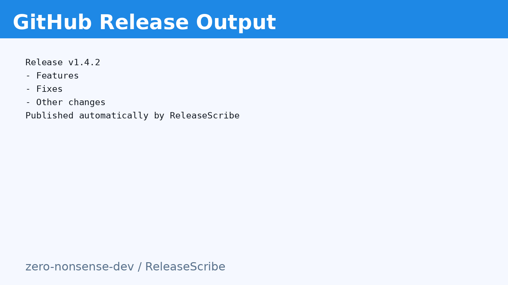

# ReleaseScribe – Automatic Changelog & Release Generator

**Short tagline:** Automatic changelogs & releases from commits

---

## Short Description
Generate clean changelogs and GitHub Releases automatically using Conventional Commits — with smart SemVer bumping, monorepo support, and zero configuration required.

---

## Full Description
**ReleaseScribe** is a zero‑nonsense GitHub Action that transforms your Conventional Commits into structured changelog entries, computes the next SemVer version, updates `CHANGELOG.md`, and publishes a GitHub Release — fully automated and idempotent.

It’s perfect for developers and teams who want consistent release notes, predictable versioning, clean automation, and no manual editing.

### Key Features
- **Automatic Semantic Versioning**: `feat` → minor, `fix|refactor|perf` → patch, `BREAKING CHANGE` → major. Or override via `release-type`.
- **Keep‑a‑Changelog formatting**: Prepend clean, grouped sections (Features, Fixes, Other changes) to `CHANGELOG.md`.
- **GitHub Release Publishing**: Creates/releases with generated notes and sets output `next_version` (e.g., `v1.4.2`).
- **First‑Class Monorepo Support**: Per‑package changelogs in `packages/*` + root summary and a single release.
- **Fully Configurable**: `release-type`, `changelog-path`, `prev-tag`, `next-tag`, `preset|preset-path`, `monorepo`, `packages-glob`, `github-token`.
- **Reliable & Tested**: Unit tests for bumping, changelog, presets, monorepo, and idempotency; safe writes with SHA checks.

### Usage
```yaml
permissions:
  contents: write

steps:
  - uses: actions/checkout@v4

  - name: Generate changelog & release
    uses: zero-nonsense-dev/releasescribe-action@v1
    with:
      release-type: auto
      monorepo: false
```

**Monorepo example:**
```yaml
- name: Release monorepo packages
  uses: zero-nonsense-dev/releasescribe-action@v1
  with:
    monorepo: true
    packages-glob: packages/*
```

### Branding (Marketplace)
- `branding.icon`: `book-open`
- `branding.color`: `blue`

### Recommended Tags
`changelog`, `release`, `semantic-versioning`, `conventional-commits`, `automation`, `versioning`, `release-notes`, `monorepo`, `ci-cd`

---

## Gallery Captions (for screenshots)
1. **What ReleaseScribe Does** — Automatically generate changelogs and GitHub Releases from your Conventional Commits.

2. **Generated Changelog Example** — Clean Keep‑a‑Changelog formatting with feature, fix, and change grouping.

3. **Monorepo Mode in Action** — Automatic per‑package changelogs plus a root summary.

4. **Workflow Configuration** — Simple integration — just add ReleaseScribe to your workflow.

5. **GitHub Release Output** — Publishes Releases automatically with structured notes.

